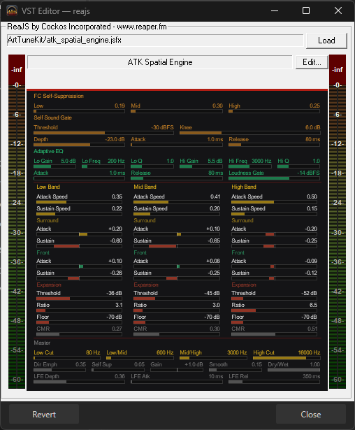
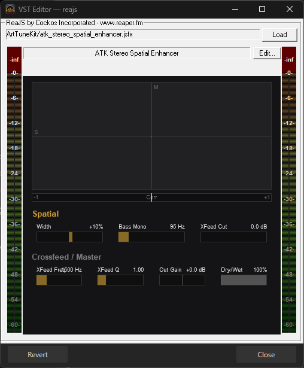

# 2026.04-AvalonEraUpdate

## 2026.04.1 -- Treble Correction

Adjusted all BO7 S3 pre-HeSuVi configs and the S3 target curve to correct unintended boosts in the high end/treble. HSC removed, AEQ Hi reduced across all variations.

**What to do:**
1. Download the updated release ZIP and drag the `library/` folder into ArtTuneDB, overwrite when prompted
2. **Regenerate your headphone EQ** using the updated `BO7_Target_S3.txt` on squig.link -- the old EQ will have incorrect treble
3. App users: delete any existing S3 profiles and recreate them in the profile wizard

---

## BO7 Season 3 + Custom JSFX Plugins + Tune Variations

### What's New

**New Tune: BO7 Season 3**
Complete retune of the BO7 audio chain built around two custom JSFX plugins. Redesigned pre-HeSuVi processing with multiband transient shaping, center-channel self-sound suppression, correlated noise rejection, and adaptive EQ. Cleaner surround field, better footstep definition, reduced gunfire fatigue.

**Custom JSFX Plugins**
Two new plugins ship with this release:

- **ATK Spatial Engine** (`atk_spatial_engine.jsfx`) -- 59-parameter plugin running on all 8 channels (7.1 + LFE) of raw game audio before HeSuVi. Reads the center channel to identify your own sounds (gun, reload, footsteps) and suppresses them while lifting enemy audio. Splits into frequency bands, separates transient hits from sustained tails, and kills ambient noise (AC units, fire, wind, map drone) while preserving sharp impacts like footsteps and reload clicks. Removes correlated ambient noise across surround channels -- drone appears in all channels equally and gets subtracted, footsteps appear in one channel and pass through. Reads the LFE channel to gauge scene intensity and adjusts processing strength accordingly.
- **ATK Stereo Spatial Enhancer** (`atk_stereo_spatial_enhancer.jsfx`) -- 7-parameter plugin running on stereo output after HeSuVi. Decodes to mid/side, keeps bass centered, cuts crossfeed bleed from HRIR convolution, and scales stereo width for tighter directional precision. Includes a Lissajous visualization and correlation meter.

Plugins install to `C:\Program Files\VSTPlugins\ReaPlugs\JS\Effects\ArtTuneKit\`. The new S3 configs require them.

**Tune Variations**
Four pre-HeSuVi config flavors for BO7 S3. Each uses the same Spatial Engine and Stereo Enhancer but with different parameter tuning:

- **Competitive** (default) -- aggressive suppression, heavy noise removal, maximum footstep separation.
- **Clean** -- lighter processing, more natural spatial image, less artificial boost.
- **Streamer** -- gun stays punchy, environment has presence, entertaining mix for content.
- **Ultra** (experimental) -- maximum footstep extraction, everything cranked. Sounds processed but every step pops.

Swap the pre file in your `config.txt` to change variation. App users can select from the status bar or right-click a profile.

**Updated Install Script**
- JSFX plugin support added. New installs get them bundled. Existing users choose `[j] Install JSFX plugins only` from the main menu.
- Script is now signed.

**New Measurements**
- Steelseries Arctis Pro Wired
- Steelseries Arctis Pro Wireless

  

  

### Install / Update

**New users:**
1. Run the install script: `irm artiswar.io/tools/ArtTuneGuided | iex`
2. Download this release ZIP from the [Releases](https://github.com/ArtIsWar/ArtTuneDB/releases) page
3. Drag the `library/` folder into your ArtTuneDB folder, overwrite when prompted
4. Update your `config.txt` to point to the BO7/S3 pre and post files
5. Launch the BO7 S3 HeSuVi preset (`.lnk` shortcut in the S3 folder)
6. Set LEQ release time per the included note file

**Existing users:**
1. Run the install script again and choose `[j]` to install JSFX plugins
2. Download this release ZIP and drag the `library/` folder into ArtTuneDB, overwrite when prompted
3. Update your `config.txt` pre and post paths to point to BO7/S3 (pick your variation)
4. Launch the BO7 S3 HeSuVi preset
5. **Regenerate your headphone EQ** using the new `BO7_Target_S3.txt` target curve -- the old S0 EQ will not match the new processing chain
6. Set LEQ release time per the included note file
